# mcp-e2e

Monorepo for the MCP E2E project.

## System Prerequisites

Before you begin, ensure you have the following installed:

- **Node.js**: A recent LTS version (e.g., v18 or v20+). You can use [nvm](https://github.com/nvm-sh/nvm) (for Linux/macOS) or [nvm-windows](https://github.com/coreybutler/nvm-windows) to manage Node.js versions.
- **pnpm**: This project uses pnpm for package management. Install it globally via npm: `npm install -g pnpm`.
- **Git**: For version control.

## Getting Started

Follow these steps to get the project up and running on your local machine:

1.  **Clone the repository**:

    ```bash
    git clone <repository-url>
    cd mcp-e2e
    ```

2.  **Install dependencies**:
    Use pnpm to install dependencies across the monorepo.

    ```bash
    pnpm install
    ```

3.  **Run the development server (mcp-client)**:
    To start the Next.js client application:

    ```bash
    pnpm --filter "@mcp-e2e/mcp-client" dev
    ```

    This will typically start the client at `http://localhost:3000`.

4.  **Running MCP Servers**:
    MCP servers are external processes that the `mcp-client` communicates with. Ensure that any MCP servers you intend to use (as defined in `packages/mcp-client/mcp.config.json`) are running independently. For example, if you have a Python-based MCP server, you would start its virtual environment and run its main script.

## MCP Server Configuration

The `mcp-client` discovers and interacts with various MCP (Multi-Capability Provider) servers based on a configuration file. The default examples assume a macOS or Linux environment.

### Configuration File

- **Location**: `packages/mcp-client/mcp.config.json`

### Structure

The `mcp.config.json` file is a JSON object that contains global LLM settings and configurations for various MCP (Multi-Capability Provider) servers.

```json
{
  "llm": {
    "provider": "bedrock",
    "model": "anthropic.claude-3-5-sonnet-20241022-v2:0",
    "defaultSystemPrompt": "You are a helpful AI. Today is {today_datetime}.",
    "temperature": 0.1,
    "maxTokens": 2048,
    "maxSteps": 20
  },
  "mcpProviders": {
    "unique-provider-id-1": {
      "name": "Provider Display Name 1 (macOS/Linux Example)",
      "command": "npx",
      "args": ["-y", "some-mcp-package@latest"],
      "env": {
        "ENV_VAR_FOR_PROVIDER": "value"
      },
      "disabled": false,
      "autoApprove": ["tool_name_to_auto_approve"]
    },
    "unique-provider-id-2": {
      "name": "Provider Display Name 2 (Python Example)",
      "command": "python3",
      "args": ["-m", "my_mcp_server_module"],
      "disabled": false
      // ... other provider-specific fields
    }
    // ... more provider configurations
  }
}
```

### Key Sections and Fields:

#### `llm` Object:

This object configures the primary Large Language Model used by the client.

- `provider`: The LLM provider (e.g., "bedrock", "openai").
- `model`: The specific model identifier.
- `defaultSystemPrompt`: The default system prompt for the AI. Can include placeholders like `{today_datetime}`.
- `temperature`: Controls the randomness of the AI's responses.
- `maxTokens`: Maximum number of tokens in a response.
- `maxSteps`: Maximum number of steps (tool uses or LLM calls) in a sequence.

#### `mcpProviders` Object:

This object contains key-value pairs where each key is a unique `providerId` and the value is an object configuring that MCP server.

- **`providerId`** (e.g., `"aws-documentation"`, `"context7"`): The unique key for the provider.
- **Provider Configuration Object**:
  - `name`: (Required) A user-friendly name for the provider, displayed in the UI.
  - `command`: (Required) The executable, script, or command to run the MCP server (e.g., `npx`, `python3`, `node`, or a path to a script).
  - `args`: (Optional) An array of arguments to pass to the `command`.
  - `env`: (Optional) An object of environment variables to set for the MCP server process.
  - `disabled`: (Optional) Boolean. If `true`, this provider will be ignored by the client. Defaults to `false`.
  - `autoApprove`: (Optional) An array of tool names (e.g., `tool_name_to_auto_approve`) from this provider that should be automatically approved for execution without user confirmation.
  - Other provider-specific fields may also be present.

### Adding a New MCP Server

1.  **Develop your MCP Server**: Create your server application (e.g., in Python, Node.js) that can be launched via a command and communicates its capabilities and executes tasks based on an agreed-upon protocol.
2.  **Update `mcp.config.json`**:
    - Add a new key-value pair to the `mcpProviders` object. The key will be your new unique provider ID.
    - The value will be an object containing at least `name` and `command`. Add `args`, `env`, or other relevant fields as needed for your server, keeping in mind macOS/Linux conventions first.
3.  **Run your MCP Server**: Ensure your server is correctly launched by the defined `command` and `args`.
4.  **Restart `mcp-client`**: Restart the Next.js development server (`pnpm --filter "@mcp-e2e/mcp-client" dev`) for it to pick up the new configuration.

The client application will then attempt to connect to the configured MCP servers and make their capabilities available in the UI.

## Windows-Specific Configuration

If you are running this project on Windows, you may need to adjust the `command` and `args` for some MCP providers in `packages/mcp-client/mcp.config.json`, as the defaults are typically set for macOS/Linux environments.

**Key areas to adapt for Windows:**

1.  **Commands for Node.js CLIs (e.g., `npx`):**

    - A typical macOS/Linux configuration for an npx-based MCP server (like `context7`) might be:
      ```json
      "context7": {
        "name": "Context7 MCP Server",
        "command": "npx",
        "args": ["-y", "@upstash/context7-mcp@latest"]
      }
      ```
    - **Action for Windows**: You'll need to invoke `npx` via `cmd /c`:
      ```json
      "context7": {
        "name": "Context7 MCP Server",
        "command": "cmd",
        "args": ["/c", "npx", "-y", "@upstash/context7-mcp@latest"]
      }
      ```

2.  **Commands invoking specific executables (especially if platform-dependent):**
    - If a provider (like `aws-documentation`) uses a command that might fetch platform-specific tools (e.g., via `uvx`), the macOS/Linux version might implicitly get the correct binary or script:
      ```json
      "aws-documentation": {
        "name": "AWS Documentation Agent",
        "command": "uvx",
        "args": [
          "--from",
          "awslabs-aws-documentation-mcp-server@latest",
          "awslabs.aws-documentation-mcp-server" // Assuming this resolves to a script or platform binary
        ]
      }
      ```
    - **Action for Windows**: If the above doesn't work directly on Windows, you might need to specify the `.exe` if one is provided and required for Windows execution:
      ```json
      "aws-documentation": {
        "name": "AWS Documentation Agent",
        "command": "uvx",
        "args": [
          "--from",
          "awslabs-aws-documentation-mcp-server@latest",
          "awslabs.aws-documentation-mcp-server.exe" // Explicitly use .exe for Windows
        ]
      }
      ```
      Alternatively, the tool itself (like `uvx`) might have Windows-specific invocation patterns or require certain environment setup.

**General Steps for Windows Adaptation:**

- For each provider in `mcp.config.json`, check if the `command` and `args` will run correctly on Windows.
- If a command is a script or common CLI tool (like `npx`, `python3`), ensure it's in your Windows PATH or invoked correctly (e.g., `python` instead of `python3` if that's how your PATH is set up, or using `cmd /c` for `npx`).
- If a command refers to a binary without an extension, you might need to add `.exe` for Windows.
- The core client (`pnpm --filter "@mcp-e2e/mcp-client" dev`) and general pnpm/Node.js commands should work as described once your Windows environment is set up with Node.js, pnpm, and Git.

## MCP Client/Server Workflow and Data Flow

This section explains how the MCP client (Next.js application) interacts with MCP servers and the LLM to process user requests, particularly when tools are involved.

### High-Level Overview

The system is designed to allow a Large Language Model (LLM) to leverage external tools provided by various MCP (Multi-Capability Provider) servers. These MCP servers are typically STDIO-based applications that the `mcp-client` backend can communicate with.

1.  **Client-Side UI (`ChatBox`)**: Handles user input, displays messages, and manages the chat state.
2.  **API Routes (Next.js Backend)**:
    - `/api/chat-handler`: Orchestrates the interaction with the LLM and MCP servers. It discovers tools from MCPs, presents them to the LLM, and streams responses back to the client.
    - `/api/execute-tool`: A dedicated endpoint called by the client to request the execution of a specific tool by an MCP server.
    - `/api/mcp-stdio-handler`: Manages the lifecycle (spawn, STDIN/STDOUT communication, terminate) of an MCP server process for tool execution.
3.  **MCP Servers**: Independent processes (often Python scripts or other executables) that expose tools. They receive commands and arguments via STDIN and return results via STDOUT.
4.  **LLM (via Vercel AI SDK)**: Processes user messages, decides when to use tools, and generates responses based on tool outputs.

### Component Responsibilities

- **`mcp-client` (Next.js Frontend - `ChatBox/index.tsx`)**:

  - Captures user messages.
  - Sends chat history to `/api/chat-handler`.
  - Receives streaming text and tool call requests from `/api/chat-handler`.
  - When a tool call is requested by the LLM, it sends a request to `/api/execute-tool` with the tool details provided by the LLM.
  - Sends the tool execution result back to `/api/chat-handler` (implicitly via the Vercel AI SDK `useChat` hook).
  - Displays final LLM responses and tool invocation details.

- **`/api/chat-handler` (Next.js Backend)**:

  - On receiving a chat request, it first initializes all configured MCP providers.
  - For each STDIO-based MCP provider defined in `mcp.config.json`, it uses `createMCPClient` and `StdioMCPTransport` to prepare for communication (though full process spawning for tool discovery might be deferred or managed differently from execution).
  - It discovers available tools from these MCPs. The schemas of these tools are augmented to instruct the LLM to include `command` (the original tool name) and `provider_id_for_tool_execution` in its arguments when calling a tool.
  - It then calls `streamText` (Vercel AI SDK) with the user's messages and the collection of augmented tools.
  - It streams text responses and tool call requests (via `onToolCall` handled by the client) and tool results (received from client and passed back to LLM) from/to the Vercel AI SDK.

- **`/api/execute-tool` (Next.js Backend)**:

  - Receives the `llmToolName` (the name the LLM used) and `toolArgsFromLlm` from the client (`ChatBox`).
  - Extracts `provider_id_for_tool_execution` and `command` (the original tool key) from `toolArgsFromLlm`.
  - Calls the `executeMcpTool` utility function, passing the `provider_id_for_tool_execution` and `JSON.stringify(toolArgsFromLlm)` as `inputData`.
  - Returns the tool execution result to the client (`ChatBox`).

- **`lib/mcp-tool-executor.ts` (Server-side utility - not directly an API route)**:

  - This utility (not shown but inferred) likely makes a POST request to `/api/mcp-stdio-handler`, forwarding the `providerId` and the stringified `toolArgsFromLlm` as `inputData`.

- **`/api/mcp-stdio-handler` (Next.js Backend)**:

  - Receives `providerId` and `inputData` (a JSON string containing `command` and other parameters from the LLM).
  - Looks up the MCP provider's configuration (e.g., the actual script/executable to run) from `mcp.config.json`.
  - Spawns the MCP server as a child process.
  - Writes the `inputData` string to the STDIN of the child process.
  - Captures STDOUT and STDERR from the child process.
  - Returns the captured output (and exit code) to its caller (`executeMcpTool`).

- **MCP Server Process (e.g., a Python script)**:
  - Launched by `/api/mcp-stdio-handler`.
  - Reads the JSON string from STDIN, parses it to get the `command` (tool to execute) and its arguments.
  - Executes the requested tool logic.
  - Prints the tool's result as a JSON string (usually) to STDOUT.
  - Exits.

### Data Flow: User Message with Tool Call

1.  **User sends message**: User types a message in `ChatBox` and submits.
2.  **Client to Chat Handler**: `ChatBox` POSTs messages to `/api/chat-handler`.
3.  **Chat Handler to LLM**: `/api/chat-handler` initializes MCPs, gets tools (augmenting their schemas), and sends messages + tools to the LLM via `streamText`.
4.  **LLM decides tool use**: LLM processes the request and decides to use a tool. It generates a tool call request (e.g., for `Context7_ResolveLibraryId` with arguments including `command: "resolve-library-id"`, `provider_id_for_tool_execution: "context7"`, and other specific parameters like `libraryName`).
5.  **LLM to Chat Handler (Tool Call Info)**: `streamText` streams this tool call information back, which is picked up by the `onToolCall` callback in `ChatBox` on the client-side.
6.  **Client to Execute Tool API**: `ChatBox`'s `onToolCall` handler makes a POST request to `/api/execute-tool` with `llmToolName` and `toolArgsFromLlm`.
7.  **Execute Tool API to Stdio Handler API**: `/api/execute-tool` (via `executeMcpTool` lib) POSTs to `/api/mcp-stdio-handler` with the target `providerId` and the stringified `toolArgsFromLlm` as `inputData`.
8.  **Stdio Handler Spawns MCP Server**: `/api/mcp-stdio-handler` finds the provider's command in `mcp.config.json`, spawns the MCP server process, and sends `inputData` to its STDIN.
9.  **MCP Server Executes**: The MCP server process reads STDIN, executes the specified `command` (e.g., "resolve-library-id") with the provided arguments, and prints its result (JSON string) to STDOUT.
10. **Result to Stdio Handler**: `/api/mcp-stdio-handler` captures STDOUT, packages it, and returns it to `/api/execute-tool`.
11. **Result to Client**: `/api/execute-tool` returns the execution result to `ChatBox` (`onToolCall`'s fetch request).
12. **Client to Chat Handler (Tool Result)**: The `useChat` hook in `ChatBox` takes the result from `onToolCall` and sends it back to `/api/chat-handler` / `streamText` as a tool result message.
13. **Chat Handler to LLM (Tool Result)**: `streamText` sends this tool result to the LLM.
14. **LLM Generates Final Response**: LLM uses the tool's output to generate the final textual answer.
15. **LLM to Chat Handler to Client**: This final response is streamed back through `/api/chat-handler` to `ChatBox` and displayed to the user.

### Sequence Diagram (Mermaid)

```mermaid
sequenceDiagram
    participant User (Client UI)
    participant ChatBox (Next.js Frontend)
    participant API_ChatHandler (/api/chat-handler)
    participant Vercel_AI_SDK (streamText)
    participant LLM
    participant API_ExecuteTool (/api/execute-tool)
    participant Lib_ExecuteMcpTool (Server Util)
    participant API_StdioHandler (/api/mcp-stdio-handler)
    participant MCP_Server_Process (External Process)

    User->>ChatBox: Sends message
    ChatBox->>API_ChatHandler: POST /api/chat-handler (messages)
    activate API_ChatHandler
    API_ChatHandler->>API_ChatHandler: Initialize MCPs, Discover & Augment Tools
    API_ChatHandler->>Vercel_AI_SDK: streamText(messages, augmentedTools)
    activate Vercel_AI_SDK
    Vercel_AI_SDK->>LLM: Process messages + tools
    activate LLM
    LLM-->>Vercel_AI_SDK: Request Tool Call (toolName, args_with_command_and_providerId)
    deactivate LLM
    Vercel_AI_SDK-->>ChatBox: streamText onToolCall(toolCallInfo)
    deactivate Vercel_AI_SDK
    deactivate API_ChatHandler

    activate ChatBox
    ChatBox->>API_ExecuteTool: POST /api/execute-tool (llmToolName, toolArgsFromLlm)
    deactivate ChatBox
    activate API_ExecuteTool
    API_ExecuteTool->>Lib_ExecuteMcpTool: executeMcpTool(providerId, stringified_toolArgsFromLlm)
    activate Lib_ExecuteMcpTool
    Lib_ExecuteMcpTool->>API_StdioHandler: POST /api/mcp-stdio-handler (providerId, inputData)
    activate API_StdioHandler
    API_StdioHandler->>MCP_Server_Process: Spawn process & write inputData to STDIN
    activate MCP_Server_Process
    MCP_Server_Process-->>API_StdioHandler: Write result to STDOUT, process exits
    deactivate MCP_Server_Process
    API_StdioHandler-->>Lib_ExecuteMcpTool: Return captured STDOUT/STDERR
    deactivate API_StdioHandler
    Lib_ExecuteMcpTool-->>API_ExecuteTool: Return tool result
    deactivate Lib_ExecuteMcpTool
    API_ExecuteTool-->>ChatBox: Return tool execution result
    deactivate API_ExecuteTool

    activate ChatBox
    ChatBox->>Vercel_AI_SDK: Provide tool result (via useChat hook)
    deactivate ChatBox
    activate Vercel_AI_SDK
    Vercel_AI_SDK->>LLM: Send tool result
    activate LLM
    LLM-->>Vercel_AI_SDK: Generate final text response
    deactivate LLM
    Vercel_AI_SDK-->>ChatBox: Stream final text response
    deactivate Vercel_AI_SDK

    activate ChatBox
    ChatBox->>User (Client UI): Display final response
    deactivate ChatBox

```



**Note on `ChatBox/index.tsx` `onToolCall` implementation**: For the above generalized flow to work for all tools (not just `filesystem_`), the `onToolCall` function within `packages/mcp-client/components/ChatBox/index.tsx` would need to consistently use the `toolArgsFromLlm` (which includes `command` and `provider_id_for_tool_execution` provided by the LLM due to schema augmentation in `chat-handler`) to call `/api/execute-tool`. The current version in the attached files has specific handling for `filesystem_` tools and a fallback simulation for others. The description above assumes the intended, more general pattern.
